## 環境構築

動作には`Node.js`が必要です。インストーラをダウンロードします。

* [Node.js](https://nodejs.org/ja/)

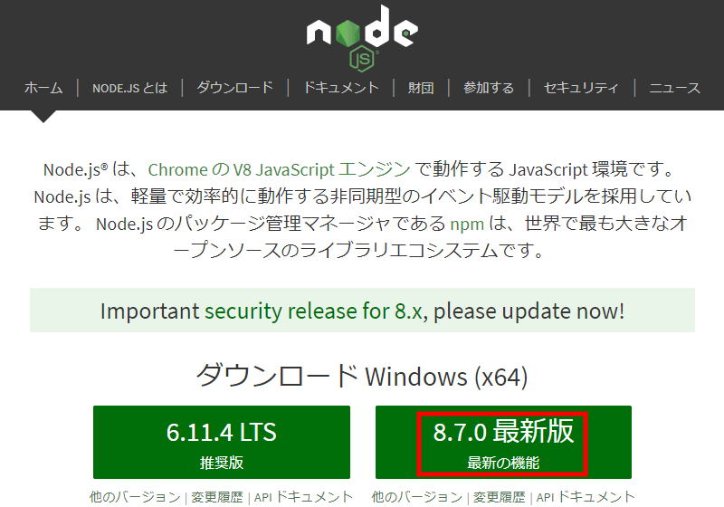

「最新版」で問題ないですが、動作しない場合は「推奨版」をインストールしてお試しください。

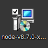

ダウンロードしたらアイコンをダブルクリックしてインストーラを立ち上げます。

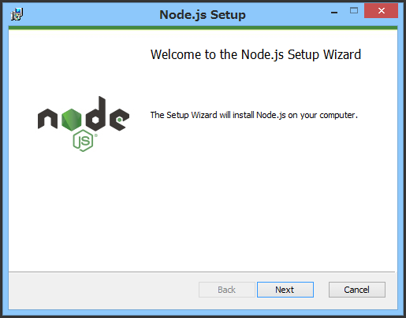

インストーラの準備ができ「Next」が有効になったらクリックします。

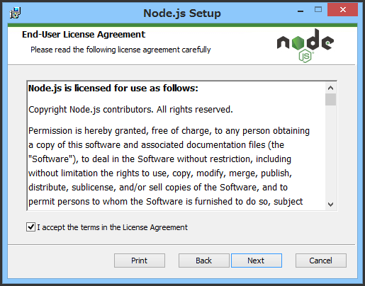

「ライセンスに同意する」にチェックを入れて、「Next」が有効になったらクリックします。

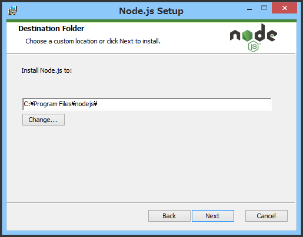

変更せずに「Next」をクリックします。

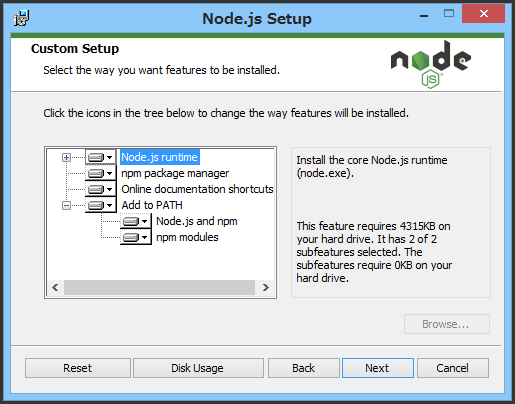

変更せずに「Next」をクリックします。

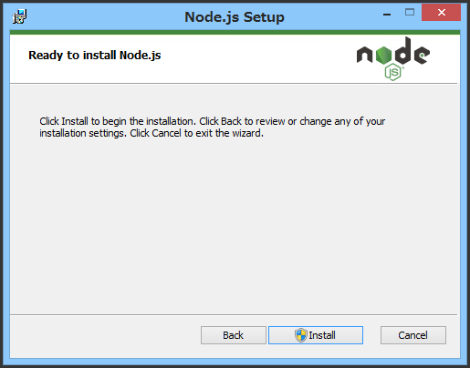

「Install」をクリックします。

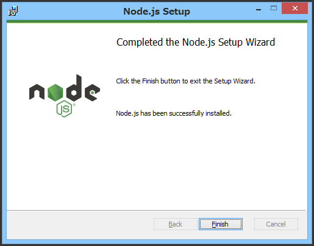

しばらく待ち、この画面が表示されればインストール完了です。

「Finish」をクリックして終了します。

インストールが完了したら、ここで再起動してください。

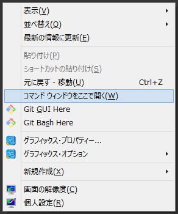

デスクトップなどでよいので、`Shiftキー`を押しながら右クリックをしてください。

`コマンドウィンドウをここで開く(W)`という項目が表示されるので、これをクリックしてください。

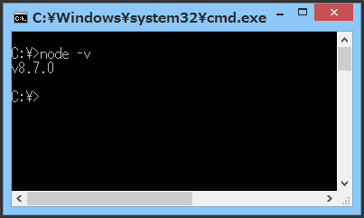

表示されたウィンドウで`node -v`と入力して`Enter`キーで確定するとバージョンが表示されます。

これで環境構築は完了です。

## 初期設定

### ライブラリのインストール

nem Petit ICOの動作に必要なライブラリのダウンロードを行います。

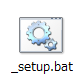

`_setup.bat`をダブルクリックしてください。

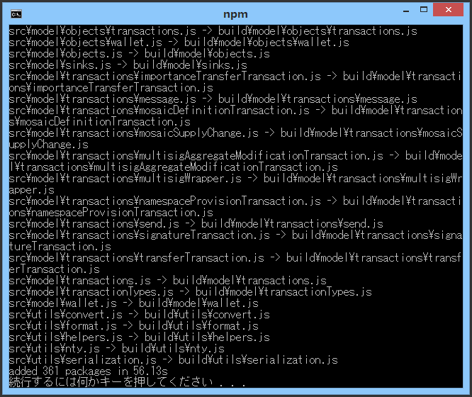

ウィンドウに`続行するには何かキーを押してください . . .`と表示されたら完了です。

何かキーを押すか、ウィンドウを閉じてください。

### 設定ファイルの設置

[Usage - nem Petit ICO](usage#setting)

こちらを参照してください。

## 実行

### トークンセール

モザイクの交換を実行します。

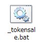

`_tokensale.bat`をダブルクリックしてください。

### 受領確認

受信アドレスに届いたxemの集計を表示します。

`_status.bat`をダブルクリックしてください。

