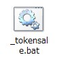

## 環境構築

動作には`Node.js`が必要です。インストーラをダウンロードします。

* [Node.js](https://nodejs.org/ja/)


「最新版」で問題ないですが、動作しない場合は「推奨版」をインストールしてお試しください。


ダウンロードしたらアイコンをダブルクリックしてインストーラを立ち上げます。


インストーラの準備ができ「Next」が有効になったらクリックします。


「ライセンスに同意する」にチェックを入れて、「Next」が有効になったらクリックします。


変更せずに「Next」をクリックします。


変更せずに「Next」をクリックします。


「Install」をクリックします。


しばらく待ち、この画面が表示されればインストール完了です。

「Finish」をクリックして終了します。

インストールが完了したら、ここで再起動してください。


デスクトップなどでよいので、`Shiftキー`を押しながら右クリックをしてください。

`コマンドウィンドウをここで開く(W)`という項目が表示されるので、これをクリックしてください。


表示されたウィンドウで`node -v`と入力して`Enter`キーで確定するとバージョンが表示されます。

これで環境構築は完了です。

## 初期設定

### ライブラリのインストール

nem Petit ICOの動作に必要なライブラリのダウンロードを行います。


`_setup.bat`をダブルクリックしてください。


ウィンドウに`続行するには何かキーを押してください . . .`と表示されたら完了です。

何かキーを押すか、ウィンドウを閉じてください。

### 設定ファイルの設置

`config/env.sample`をコピーして`config/env`として配置してください。

`config/env`をテキストエディタで開き、内容を適宜編集してください。

```
# testnet/mainnet ネットワークを指定します。
NEM_NETWORK=testnet

# 接続するノードを指定します。(空白の場合はnem-sdkのデフォルトが利用されます)
# (e.g. http://62.75.171.41)
NEM_NODE=

# 接続するノードのポートを指定します。(default: 7890)
NEM_PORT=

# 0を設定することで実際の送金が行われます。(安全装置としてのフラグです)
MOSAICSALE_DRYRUN=1

# 対象とするトランザクションの期間を指定します。
# ISO8601形式で指定してください。
MOSAICSALE_MIN_TIME=2017-10-12T00:00:00+0900
MOSAICSALE_MAX_TIME=2017-10-12T23:59:59+0900

# xem受信アドレスを指定します。(空白の場合は秘密鍵のアドレスが利用されます)
MOSAICSALE_SINK=__PUT_XEM_RECEIVE_ADDRESS__

# 配布するモザイクをを保有する秘密鍵を指定します。
MOSAICSALE_PKEY=__PUT_PRIVATE_KEY_MOSAIC_OWNED__

# マルチシグアドレスの公開鍵を指定します。(モザイクの配布元をマルチシグにする場合)
MOSAICSALE_MSIG_PUB=__PUT_MULTISIG_PUBLIC_KEY__

# 送信するモザイクを指定します。(e.g. nem:xem)
MOSAICSALE_MOSAIC_FQN=__PUT_MOSAIC_FULL_NAME__

# 最低必要xem量を指定します。(1000000 = 1xem)
MOSAICSALE_MIN_XEM=1000000

# モザイク送信時のメッセージを指定します。
MOSAICSALE_MESSAGE=
```

xem受取アドレスとは別のアカウント秘密鍵を設定することもできます。

## 実行

### 参加アドレスの集計

`MOSAICSALE_SINK`アドレスに送られた`xem`を集計します。



`_aggregate.bat`をダブルクリックしてください。

アドレスごとに受け取ったxemの集計を行い、モザイク送信用の中間ファイルを生成します。

中間ファイルは`tmp/applicants.json`として保存されます。

* `candidates`: モザイクを送信するアドレス
* `receives`: xemを受け取ったアドレス
* `sents`: モザイクを送信したアドレス

それぞれの情報がこのファイルにまとめられます。

これは`distribute`コマンド実行時に読み込まれて使用されます。

## モザイクの配布

集計結果`tmp/applicants.json`の内容である`candidates`のアドレスへ割り当てられたモザイク数を送信します。

`_distribute.bat`をダブルクリックしてください。

`tmp/applicants.json`の`"candidates"`に記されたアドレスに割り当てられたモザイクを送信します。

送信時にも未承認、承認済みトランザクションの確認も行うため二重に実行しても重複してモザイクを送信しません。

### DRYRUN機能

`config/env`の`MOSAICSALE_DRYRUN`の値が`0`以外に設定されている場合、トランザクションを発行しません。

実際に送信する直前に、送信先が想定通りかを確認するための機能です。

`0`を設定した状態で`distribute`を実行すると、実際の送信が行えます。
